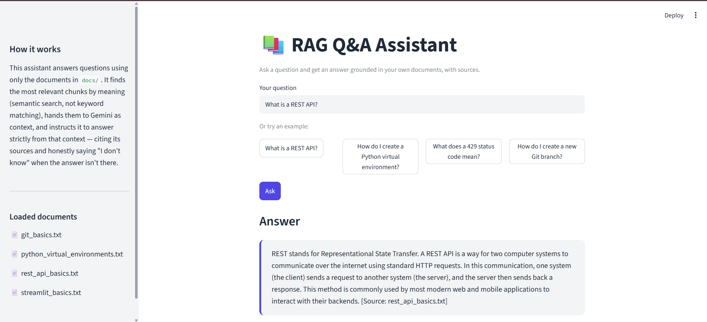

# RAG Q&A Assistant

A "chat with your documents" web app. Ask it a question, and it answers **using only the documents you gave it** — with source citations, and an honest "I don't know" when the answer isn't in there.

This is a Retrieval-Augmented Generation (RAG) system: the model doesn't answer from memory, it retrieves relevant text from an indexed knowledge base and grounds its answer in that text, which prevents made-up answers ("hallucinations") and makes every answer traceable to a source file.

<!-- Screenshot: replace with an actual screenshot of the app in Answer/Sources state -->
<!--  -->

**Live demo:** _add your Streamlit Community Cloud URL here after deploying_

## How it works

```
question ──▶ embed ──▶ search ChromaDB ──▶ top 4 relevant chunks
                                                    │
                                                    ▼
                              prompt = chunks + question + instructions
                                                    │
                                                    ▼
                                          Gemini (gemini-2.5-flash)
                                                    │
                                                    ▼
                                   answer + list of source filenames
```

1. **Ingestion** (`ingest.py`) — reads every file in `docs/`, splits each into ~800-character overlapping chunks, embeds them with ChromaDB's built-in local embedding model, and stores them in a persistent vector database (`./chroma`).
2. **Retrieval** (`rag.py`) — embeds the incoming question the same way, then searches Chroma for the 4 chunks whose meaning is closest to it (semantic search, not keyword matching).
3. **Grounded generation** (`rag.py`) — builds a prompt containing only those chunks plus the question, and instructs Gemini to answer strictly from that context and cite its sources.
4. **Evaluation** (`eval.py`) — runs a fixed set of test questions through the same pipeline and uses Gemini as an automatic judge to score answer quality, so correctness is measured, not assumed.

## Stack

| Layer | Choice |
|---|---|
| Language | Python 3.11+ |
| LLM | Google Gemini (`gemini-2.5-flash`) via the `google-genai` SDK |
| Embeddings | ChromaDB's built-in local embedding function |
| Vector database | ChromaDB (persistent, local) |
| Document reading | `pypdf` for PDFs, plain text for `.txt` / `.md` |
| UI | Streamlit |
| Deployment | Streamlit Community Cloud |

No LangChain or other RAG framework — the retrieval and prompting logic is written directly so every step is visible and easy to reason about.

## Project structure

```
rag-qa-assistant/
├── docs/                # source documents the assistant answers from
├── ingest.py             # loads docs → chunks → stores in Chroma
├── rag.py                # retrieves relevant chunks + asks the LLM
├── llm.py                # thin wrapper around the Gemini API call (with retry/backoff)
├── app.py                # Streamlit web app
├── ask.py                # command-line way to ask a question
├── eval.py                # LLM-judged evaluation script
├── eval_questions.json   # test questions + expected answers
└── requirements.txt
```

## Running it locally

1. Clone the repo and create a virtual environment:
   ```
   git clone <your-repo-url>
   cd rag-qa-assistant
   python -m venv venv
   venv\Scripts\activate      # Windows
   source venv/bin/activate   # macOS/Linux
   pip install -r requirements.txt
   ```
2. Get a free Gemini API key from [aistudio.google.com](https://aistudio.google.com), then create a `.env` file in the project root:
   ```
   GEMINI_API_KEY=your-key-here
   ```
3. Add your own `.txt`, `.md`, or `.pdf` files to `docs/` (a few sample docs are included).
4. Build the index:
   ```
   python ingest.py
   ```
5. Ask a question from the command line:
   ```
   python ask.py "your question here"
   ```
   or launch the web app:
   ```
   streamlit run app.py
   ```
6. (Optional) Check answer quality:
   ```
   python eval.py
   ```

## Deploying to Streamlit Community Cloud

1. Push this repo to GitHub (see below).
2. Go to [share.streamlit.io](https://share.streamlit.io), sign in, and deploy a new app pointing at this repo's `app.py`.
3. In the app's **Settings → Secrets**, add:
   ```
   GEMINI_API_KEY = "your-key-here"
   ```
   **Never commit your API key to GitHub** — it's kept out of the repo via `.gitignore` and only lives in Streamlit's Secrets settings for the deployed app.

## What I'd improve next

- Re-rank retrieved chunks before sending them to the model, instead of relying on raw similarity order.
- Stream the model's response instead of waiting for the full answer.
- Handle larger document sets with metadata filtering (e.g. search within one file).
